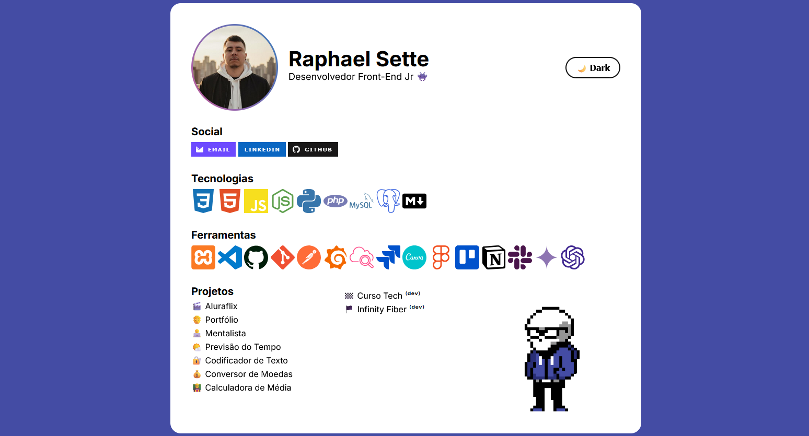

 

# 🧑 Portfólio

Este repositório contém o código-fonte do meu portfólio pessoal, onde apresento minhas competências, as ferramentas que utilizo no dia a dia e os projetos que desenvolvi.

## 🎨 Funcionalidades do Portfólio
* **Dark Mode Nativo:** Sistema de alternância de temas (Light/Dark) implementado com manipulação de classes via JavaScript e variáveis de CSS.
* **Responsividade:** Ajustado para diferentes tamanhos de tela (Mobile e Desktop) através de Media Queries.
* **Animações:** Utilização de animações `@keyframes` para efeitos visuais, como a borda RGB animada na foto de perfil.

## 💻 Como Visualizar

O projeto pode ser acessado diretamente através do GitHub Pages: 👉 https://raphaelsette.github.io/

  
## 📝 Referências

 - <a href="https://fonts.google.com/" target="_blank">Google Fonts</a>
 - <a href="https://widgetcore.com/how-to-create-rainbow-gradient-borders-in-css/" target="_blank">Rainbow Gradient Borders in CSS</a>
 - <a href="https://www.w3schools.com/howto/howto_js_toggle_dark_mode.asp" target="_blank">Toggle Dark Mode</a>
 - <a href="https://getemoji.com/" target="_blank">Get Emoji</a>
 - <a href="https://giphy.com/gifs/animation-animated-5hmgfdvimPl5NjTUU6" target="_blank">8 Bit Animation Sticker By HAZ</a>
 - <a href="https://simpleicons.org/" target="_blank">Simpleicons</a>
